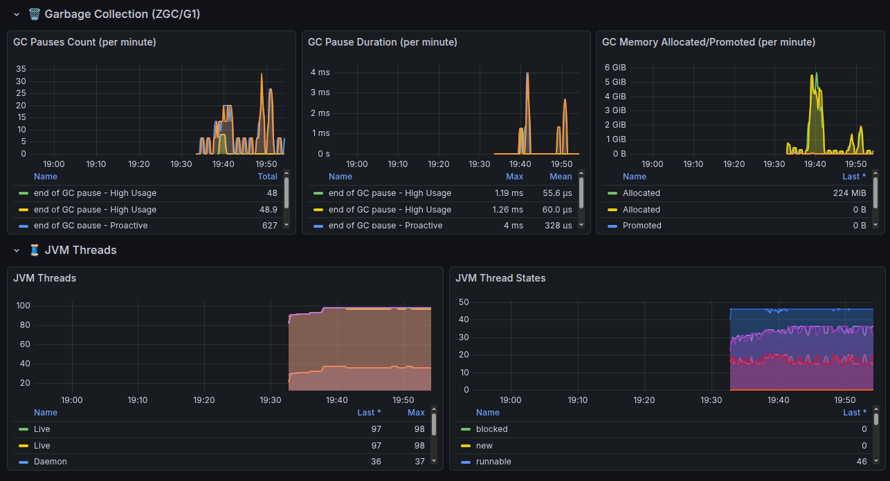
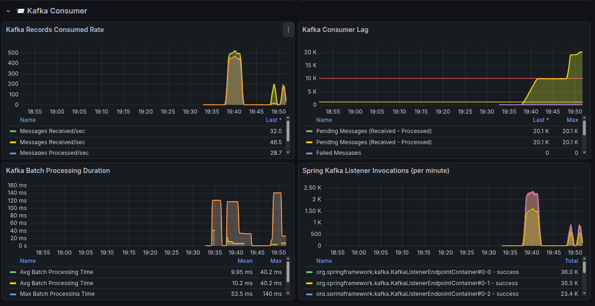
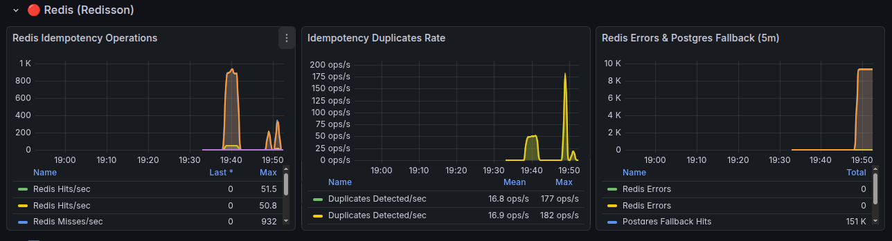
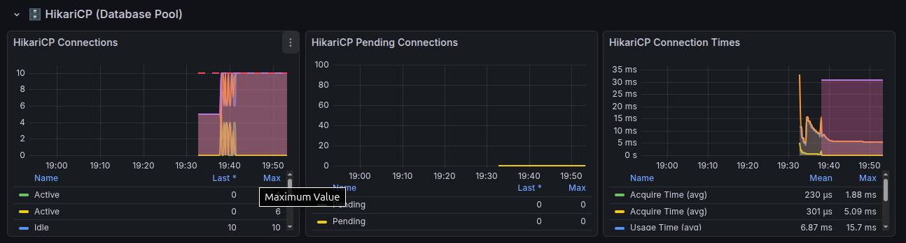

# Kafka Consumer de Alto Volume com Idempotência

## 📋 Visão Geral

Aplicação Spring Boot 3.5.8 com Java 21 que implementa um consumidor Kafka de alto desempenho com:

- ✅ **Idempotência**: Garantia de processamento único de mensagens
- ✅ **Redis**: Cache de alta performance para controle de duplicatas
- ✅ **PostgreSQL**: Fallback e persistência de dados
- ✅ **Processamento em Batch**: Otimizado para alto volume
- ✅ **Concorrência Configurável**: Múltiplos consumers paralelos
- ✅ **Virtual Threads (Java 21)**: Máxima eficiência de recursos
- ✅ **Dead Letter Queue (DLQ)**: Tratamento de falhas
- ✅ **Métricas**: Prometheus + Grafana
- ✅ **JVM Otimizada**: ZGC Generational com tuning para containers

## 🚀 Como Executar

### Pré-requisitos

- Java 21
- Docker & Docker Compose
- Maven 3.9+

### 1. Iniciar Infraestrutura

```bash
./start.sh
```

Ou manualmente:

```bash
docker-compose up -d
```

### 2. Build da Imagem Docker (opcional)

Para construir a imagem Docker da aplicação:

```bash
# Build do JAR
mvn clean package -DskipTests

# Build da imagem Docker
docker build -t kafka-consumer-demo:latest .

# Ou usando docker-compose
docker-compose build app
```

### 3. Executar Aplicação

**Via Docker Compose (recomendado):**
```bash
docker-compose up -d app
```

**Via Maven (desenvolvimento):**
```bash
mvn spring-boot:run
```

**Via JAR:**
```bash
java -jar target/kafka-consumer-demo-1.0.0.jar
```

### 4. Produzir Mensagens de Teste

**Via Python:**
```bash
# Instalar dependência
pip install kafka-python

# Executar produtor
python3 scripts/produce_messages.py
```

**Via K6 - Direto para Kafka (recomendado):**
```bash
# Tornar executável
chmod +x scripts/run-k6-tests.sh

# Smoke test (verificação rápida)
./scripts/run-k6-tests.sh smoke -d

# Load test (carga normal)
./scripts/run-k6-tests.sh load -d

# Stress test (carga alta)
./scripts/run-k6-tests.sh stress -d

# Spike test (pico súbito)
./scripts/run-k6-tests.sh spike -d

# Throughput máximo (10k msg/s)
./scripts/run-k6-tests.sh max -d

# Todos os cenários
./scripts/run-k6-tests.sh full -d

# Customizado: Kafka em outra porta
./scripts/run-k6-tests.sh load -d -b kafka:29092 -t my-topic
```

## 📊 Acessar Interfaces

| Serviço | URL | Credenciais |
|---------|-----|-------------|
| **Aplicação** | http://localhost:8081 | - |
| **Swagger/OpenAPI** | http://localhost:8081/swagger-ui.html | - |
| **Kafka UI** | http://localhost:8090 | - |
| **pgAdmin** | http://localhost:5050 | admin@admin.com / admin |
| **RedisInsight** | http://localhost:5540 | - |
| **Prometheus** | http://localhost:9090 | - |
| **Grafana** | http://localhost:3000 | admin / admin |
| **Health Check** | http://localhost:8081/actuator/health | - |

### Configuração pgAdmin

Para conectar ao PostgreSQL no pgAdmin:
- **Host**: `postgres` (ou `localhost` se fora do docker)
- **Porta**: `5432`
- **Database**: `kafka_consumer_db`
- **Usuário**: `postgres`
- **Senha**: `postgres`

### Configuração RedisInsight

Para conectar ao Redis:
- **Host**: `redis` (ou `localhost` se fora do docker)
- **Porta**: `6379`
- **Name**: `kafka-redis`

## 🏗️ Arquitetura

```
Kafka → Consumers (10 threads) → Virtual Threads → Idempotency Check
                                                    ↓
                                            Redis (fast) / PostgreSQL (fallback)
                                                    ↓
                                              Business Logic
                                                    ↓
                                              Save Results
```

## 📈 Performance

- **Throughput**: 10.000+ mensagens/segundo
- **Latência**: <50ms p95
- **Concorrência**: 10 consumers paralelos
- **Batch Size**: 500 mensagens por poll

## 🔧 Configurações

### Variáveis de Ambiente

Copie o arquivo `.env` e ajuste conforme necessário:

```bash
cp .env.example .env
```

#### Database (PostgreSQL)

| Variável | Padrão | Descrição |
|----------|--------|-----------|
| `DB_HOST` | localhost | Host do PostgreSQL |
| `DB_USER` | postgres | Usuário |
| `DB_PASSWORD` | postgres | Senha |
| `HIKARI_MAX_POOL` | 20 | Tamanho máximo do pool |
| `HIKARI_MIN_IDLE` | 5 | Conexões mínimas idle |

#### Kafka

| Variável | Padrão | Descrição |
|----------|--------|-----------|
| `KAFKA_BROKERS` | localhost:9092 | Bootstrap servers |
| `KAFKA_GROUP_ID` | high-volume-consumer-group | Consumer group |
| `KAFKA_TOPIC` | high-volume-topic | Tópico principal |
| `KAFKA_DLQ_TOPIC` | high-volume-topic-dlq | Dead Letter Queue |
| `KAFKA_CONCURRENCY` | 10 | Número de consumers |
| `KAFKA_MAX_POLL_RECORDS` | 100 | Mensagens por poll |

#### Redis (Redisson)

| Variável | Padrão | Descrição |
|----------|--------|-----------|
| `REDIS_HOST` | localhost | Host do Redis |
| `REDIS_PORT` | 6379 | Porta |
| `REDIS_PASSWORD` | (vazio) | Senha (opcional) |
| `REDIS_POOL_SIZE` | 100 | Tamanho do pool de conexões |
| `REDIS_MIN_IDLE` | 24 | Conexões mínimas idle |
| `REDIS_IDLE_TIMEOUT` | 10000 | Timeout de conexão idle (ms) |
| `REDIS_TIMEOUT` | 3000 | Timeout de operação (ms) |
| `REDIS_RETRY_ATTEMPTS` | 3 | Tentativas de retry |
| `REDIS_RETRY_INTERVAL` | 1500 | Intervalo entre retries (ms) |
| `REDISSON_THREADS` | 16 | Threads do Redisson |
| `REDISSON_NETTY_THREADS` | 32 | Threads Netty |

### application.yml

Edite `src/main/resources/application.yml`:

```yaml
spring:
  kafka:
    listener:
      concurrency: 10  # Número de consumers
    consumer:
      properties:
        max.poll.records: 500  # Batch size
```

## ☕ JVM Otimizada para Containers

A aplicação utiliza configurações avançadas da JVM para máxima performance em containers:

```yaml
JAVA_OPTS: >-
  # Container Support
  -XX:+UseContainerSupport
  -XX:MaxRAMPercentage=75.0
  -XX:InitialRAMPercentage=50.0
  
  # ZGC Generational (Java 21)
  -XX:+UseZGC
  -XX:+ZGenerational
  -XX:ZCollectionInterval=5
  
  # Performance
  -XX:+UseStringDeduplication
  -XX:+AlwaysPreTouch
  
  # Diagnóstico
  -XX:+ExitOnOutOfMemoryError
  -XX:+HeapDumpOnOutOfMemoryError
  -XX:HeapDumpPath=/tmp/heapdump.hprof
  -XX:NativeMemoryTracking=summary
  
  # Container/DNS
  -Djava.security.egd=file:/dev/./urandom
  -Dnetworkaddress.cache.ttl=30
```

### Explicação das Flags

| Flag | Descrição |
|------|-----------|
| `UseContainerSupport` | Detecta limites de CPU/memória do container |
| `MaxRAMPercentage=75.0` | Usa 75% da RAM disponível para heap |
| `UseZGC` + `ZGenerational` | GC de baixa latência (Java 21) |
| `ZCollectionInterval=5` | Coleta proativa a cada 5s (evita picos) |
| `UseStringDeduplication` | Reduz memória com strings duplicadas |
| `AlwaysPreTouch` | Pré-aloca memória (evita page faults) |
| `HeapDumpOnOutOfMemoryError` | Gera dump para análise em OOM |
| `NativeMemoryTracking` | Rastreia memória nativa |
| `networkaddress.cache.ttl=30` | TTL DNS baixo (bom para K8s) |

## 📝 Estrutura do Projeto

```
kafka-consumer-demo/
├── src/main/java/
│   └── com/example/kafka/consumer/
│       ├── config/          # Configurações (Kafka, Redis, CORS, OpenAPI)
│       ├── consumer/        # Kafka Consumers
│       ├── controller/      # REST Controllers
│       ├── dto/             # DTOs
│       ├── entity/          # Entidades JPA
│       ├── health/          # Health checks customizados
│       ├── producer/        # Kafka Producers
│       ├── repository/      # Repositórios JPA
│       ├── scheduler/       # Jobs agendados (cleanup)
│       └── service/         # Serviços de negócio
├── src/main/resources/
│   ├── application.yml      # Configurações
│   └── db/schema.sql        # Schema do banco
├── docker-compose.yml       # Infraestrutura completa
├── monitoring/
│   ├── prometheus.yml       # Config do Prometheus
│   └── grafana-dashboards/  # Dashboards prontos
├── scripts/
│   └── produce_messages.py  # Script de teste
├── .env                     # Variáveis de ambiente
└── README.md
```

## 🐳 Serviços Docker

| Serviço | Imagem | Porta |
|---------|--------|-------|
| PostgreSQL | postgres:16-alpine | 5432 |
| pgAdmin | dpage/pgadmin4:latest | 5050 |
| Redis | redis:7-alpine | 6379 |
| RedisInsight | redis/redisinsight:latest | 5540 |
| Zookeeper | confluentinc/cp-zookeeper:7.6.0 | 2181 |
| Kafka | confluentinc/cp-kafka:7.6.0 | 9092, 29092 |
| Kafka UI | provectuslabs/kafka-ui:latest | 8090 |
| Prometheus | prom/prometheus:latest | 9090 |
| Grafana | grafana/grafana:latest | 3000 |
| App | kafka-consumer-demo:latest | 8081 |

## Preformance JVM


## Performance GC


## Performance do Kafka Consumer:


## Performance do Redis (Redisson)


## Performance Pool de conexões (Postgres)


## 🛠️ Tecnologias

- Java 21 (Virtual Threads)
- Spring Boot 3.5.8
- Apache Kafka
- PostgreSQL 16
- Redis 7
- Redisson (Locks distribuídos)
- Prometheus + Grafana

## 📄 Licença

MIT License
