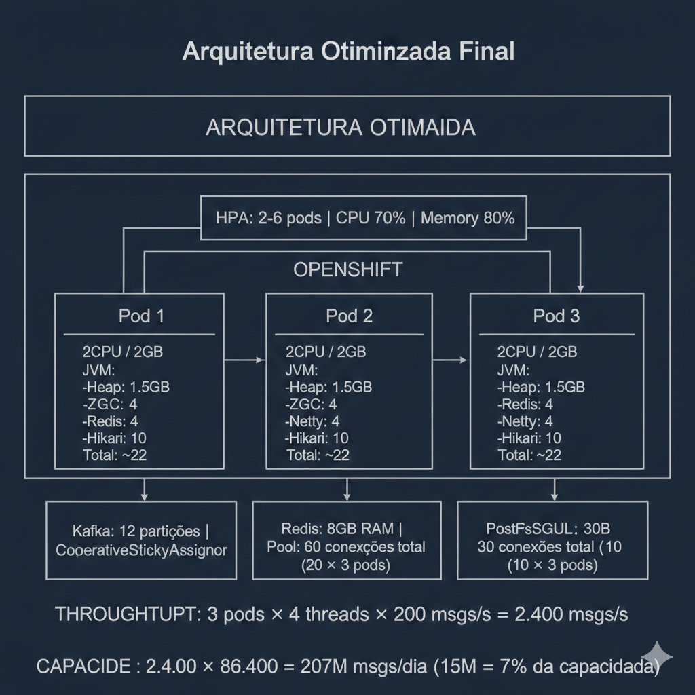

# Guia Completo de Configuração e Performance

## Índice

1. [Configuração Kafka Consumer](#1-configuração-kafka-consumer)
2. [Configuração Redisson/Redis](#2-configuração-redissonredis)
3. [Análise de Volumetria (15M/dia)](#3-análise-de-volumetria-15mdia)
4. [Configuração de Recursos OpenShift/Kubernetes](#4-configuração-de-recursos-openshiftkubernetes)
5. [JVM UseContainerSupport](#5-jvm-usecontainersupport)
6. [Correlação entre Componentes](#6-correlação-entre-componentes)
7. [Síntese Geral](#7-síntese-geral)

---

## 1. Configuração Kafka Consumer

### Consumer Settings

| Propriedade | Valor | Descrição |
|-------------|-------|-----------|
| `group-id` | `high-volume-consumer-group` | Identificador do grupo de consumidores. Todos os consumidores com este ID compartilham o consumo das partições |
| `auto-offset-reset` | `earliest` | Quando não há offset salvo, começa a ler do **início** do tópico |
| `enable-auto-commit` | `false` | Desabilita commit automático de offsets - você controla manualmente quando confirmar |
| `key-deserializer` | `StringDeserializer` | Deserializa as chaves das mensagens como String |
| `value-deserializer` | `JsonDeserializer` | Deserializa o conteúdo das mensagens de JSON para objetos Java |

### Properties Avançadas

| Propriedade | Valor | Descrição |
|-------------|-------|-----------|
| `spring.json.trusted.packages` | `com.example` | Permite deserialização JSON apenas do pacote especificado (segurança) |
| `max.poll.records` | `100` | Máximo de registros por poll - ideal para batch processing |
| `max.poll.interval.ms` | `300000` | **5 minutos** máximo entre polls antes do consumidor ser considerado "morto" |
| `session.timeout.ms` | `45000` | **45 segundos** sem heartbeat = consumidor removido do grupo |
| `fetch.min.bytes` | `1024` | Espera acumular **1KB** antes de retornar dados (reduz roundtrips) |
| `fetch.max.wait.ms` | `500` | Espera no máximo **500ms** para acumular os bytes mínimos |
| `partition.assignment.strategy` | `CooperativeStickyAssignor` | Rebalanceamento cooperativo - evita stop-the-world |

### Listener Settings

| Propriedade | Valor | Descrição |
|-------------|-------|-----------|
| `ack-mode` | `manual` | **Você controla** quando o offset é commitado (via `Acknowledgment.acknowledge()`) |
| `concurrency` | `4` | Cria threads consumidoras paralelas (baseado em CPUs × 2) |
| `poll-timeout` | `3000` | Aguarda **3 segundos** por novos dados em cada poll |
| `type` | `batch` | Recebe **lista de mensagens** ao invés de uma por vez |

### Fluxo de Processamento

```
┌─────────────────────────────────────────────────────────────┐
│                    Kafka Broker                              │
│  ┌─────────┐ ┌─────────┐ ┌─────────┐     ┌─────────┐       │
│  │Partition│ │Partition│ │Partition│ ... │Partition│       │
│  │    0    │ │    1    │ │    2    │     │    N    │       │
│  └────┬────┘ └────┬────┘ └────┬────┘     └────┬────┘       │
└───────┼───────────┼───────────┼───────────────┼────────────┘
        │           │           │               │
        ▼           ▼           ▼               ▼
┌─────────────────────────────────────────────────────────────┐
│              Consumer (concurrency: 4)                       │
│  ┌────────┐ ┌────────┐ ┌────────┐ ┌────────┐               │
│  │Thread 1│ │Thread 2│ │Thread 3│ │Thread 4│               │
│  └────────┘ └────────┘ └────────┘ └────────┘               │
│                                                              │
│  Cada poll retorna até 100 mensagens em batch               │
│  ACK manual após processamento bem-sucedido                 │
└─────────────────────────────────────────────────────────────┘
```

### Justificativas

1. **`enable-auto-commit: false` + `ack-mode: manual`** → Garante **idempotência** - você só confirma após processar com sucesso
2. **`max.poll.records: 100` + `type: batch`** → **Alto throughput** processando muitas mensagens por vez
3. **`concurrency: 4`** → Paralelismo para consumir de múltiplas partições simultaneamente (baseado em CPUs)
4. **`max.poll.interval.ms: 300000`** → Tempo generoso para processar batches grandes sem ser expulso do grupo
5. **`fetch.min.bytes` + `fetch.max.wait.ms`** → Otimiza rede aguardando acumular dados antes de buscar
6. **`CooperativeStickyAssignor`** → Evita paradas totais durante rebalanceamento

---

## 2. Configuração Redisson/Redis

**Redisson** é um cliente Redis avançado para Java que oferece estruturas de dados distribuídas, locks, caches e muito mais.

### Configurações Gerais

| Propriedade | Valor | Descrição |
|-------------|-------|-----------|
| `codec` | `JsonJacksonCodec` | Serializa/deserializa objetos usando **Jackson JSON** |
| `threads` | `4` | Threads para processar **callbacks e listeners** (CPUs × 2) |
| `netty-threads` | `4` | Threads do **Netty** para I/O de rede (CPUs × 2) |

### Single Server Config

| Propriedade | Valor | Descrição |
|-------------|-------|-----------|
| `address` | `redis://localhost:6379` | Endereço do servidor Redis |
| `connection-pool-size` | `20` | Máximo de conexões simultâneas no pool |
| `connection-minimum-idle-size` | `5` | Conexões ociosas prontas para uso imediato |
| `idle-connection-timeout` | `30000` | Conexões ociosas são fechadas após **30 segundos** |
| `timeout` | `3000` | **3 segundos** de timeout para cada operação Redis |
| `retry-attempts` | `3` | **3 tentativas** em caso de falha |
| `retry-interval` | `1500` | **1.5 segundos** de espera entre tentativas |

### Arquitetura de Threads



```
┌─────────────────────────────────────────────────────────────┐
│                    Aplicação Java                            │
│                                                              │
│  ┌────────────────────────────────────────────────────────┐ │
│  │                   Redisson Client                       │ │
│  │                                                         │ │
│  │  ┌─────────────────┐    ┌─────────────────────────┐   │ │
│  │  │  Threads: 4     │    │   Netty Threads: 4      │   │ │
│  │  │                 │    │                         │   │ │
│  │  │ • Callbacks     │    │ • Socket Read/Write    │   │ │
│  │  │ • Listeners     │    │ • Conexões TCP         │   │ │
│  │  │ • Pub/Sub       │    │ • Event Loop           │   │ │
│  │  └─────────────────┘    └─────────────────────────┘   │ │
│  │                                                         │ │
│  │  ┌─────────────────────────────────────────────────┐   │ │
│  │  │         Connection Pool (20 conexões)           │   │ │
│  │  │  ┌───┐┌───┐┌───┐┌───┐         ┌───┐┌───┐       │   │ │
│  │  │  │ 1 ││ 2 ││ 3 ││ 4 │   ...   │19 ││20 │       │   │ │
│  │  │  └───┘└───┘└───┘└───┘         └───┘└───┘       │   │ │
│  │  │     (mínimo 5 sempre prontas)                   │   │ │
│  │  └─────────────────────────────────────────────────┘   │ │
│  └────────────────────────────────────────────────────────┘ │
└─────────────────────────────────────────────────────────────┘
                              │
                              ▼
                    ┌─────────────────┐
                    │  Redis Server   │
                    │  localhost:6379 │
                    └─────────────────┘
```

### Fluxo de Retry

```
┌──────────┐     Falha      ┌──────────┐    Falha     ┌──────────┐    Falha     ┌─────────┐
│ Tentativa│───────────────▶│ Tentativa│─────────────▶│ Tentativa│─────────────▶│  Erro   │
│    1     │   1500ms       │    2     │   1500ms     │    3     │              │ Lançado │
└──────────┘                └──────────┘              └──────────┘              └─────────┘
```

### Uso no Contexto de Idempotência

```
┌─────────────────┐     ┌─────────────────┐     ┌─────────────────┐
│  Kafka Consumer │────▶│ Verificar Redis │────▶│ Processar se    │
│  (100 msgs/poll)│     │ (msg já vista?) │     │ não duplicada   │
└─────────────────┘     └─────────────────┘     └─────────────────┘
                               │
                               ▼
                        ┌─────────────────┐
                        │ Salvar ID no    │
                        │ Redis (TTL 24h) │
                        └─────────────────┘
```

---

## 3. Análise de Volumetria (15M/dia)

### Capacidade do Redis

O Redis pode processar **100.000+ operações por segundo** em hardware modesto. 15M/dia equivale a:

```
15.000.000 ÷ 86.400 segundos = ~174 operações/segundo (média)
```

Isso é **menos de 1%** da capacidade do Redis.

### Cálculo de Memória

| Parâmetro | Valor |
|-----------|-------|
| Registros/dia | 15.000.000 |
| TTL configurado | 86.400s (24h) |
| Tamanho médio da chave | ~50 bytes (UUID + prefixo) |
| Tamanho médio do valor | ~200 bytes (JSON com metadados) |
| **Overhead Redis por chave** | ~80 bytes |

```
┌─────────────────────────────────────────────────────────────┐
│              CÁLCULO DE MEMÓRIA DIÁRIA                      │
├─────────────────────────────────────────────────────────────┤
│  15M × (50 + 200 + 80) bytes = 15M × 330 bytes             │
│                                                             │
│  = 4.95 GB de RAM (pico com 24h de dados)                  │
│                                                             │
│  + 20% fragmentação = ~6 GB de RAM necessária              │
└─────────────────────────────────────────────────────────────┘
```

### Problemas Potenciais

#### 3.1 Memória e Eviction

```
┌────────────────────────────────────────────────────────────────┐
│                    ⚠️  RISCO DE MEMÓRIA                        │
├────────────────────────────────────────────────────────────────┤
│                                                                │
│  Cenário: Redis com maxmemory de 4GB                          │
│                                                                │
│  Hora 0    ████░░░░░░░░░░░░  2GB   ✓ OK                       │
│  Hora 12   ████████░░░░░░░░  4GB   ⚠️ Limite                   │
│  Hora 18   ████████████░░░░  6GB   ❌ EVICTION ou OOM          │
│                                                                │
└────────────────────────────────────────────────────────────────┘
```

**Solução no `redis.conf`:**

```conf
maxmemory 8gb
maxmemory-policy volatile-ttl
```

#### 3.2 Picos de Tráfego

A média é 174 ops/s, mas picos podem chegar a **10-50x**:

```
┌─────────────────────────────────────────────────────────────┐
│              DISTRIBUIÇÃO DE CARGA (exemplo)                 │
│                                                              │
│  Ops/s                                                       │
│  8000 │                    ▄▄                                │
│  6000 │                   ████                               │
│  4000 │                  ██████▄                             │
│  2000 │        ▄▄▄▄▄▄▄▄████████████▄▄▄▄                     │
│   174 │──▄▄▄▄██████████████████████████▄▄▄──  (média)       │
│       └──────────────────────────────────────               │
│         00h   06h   12h   18h   24h                          │
│                                                              │
│  Pico: 8.000 ops/s (46x a média)                            │
└─────────────────────────────────────────────────────────────┘
```

#### 3.3 TTL Cliff (Expiração em Massa)

```
┌─────────────────────────────────────────────────────────────┐
│              ⚠️  TTL CLIFF - PROBLEMA SÉRIO                  │
├─────────────────────────────────────────────────────────────┤
│                                                              │
│  Dia 1, 10:00  → 500.000 registros criados (pico manhã)     │
│  Dia 2, 10:00  → 500.000 registros EXPIRAM JUNTOS           │
│                                                              │
│  Resultado: CPU spike no Redis para cleanup                 │
│                                                              │
└─────────────────────────────────────────────────────────────┘
```

**Solução - TTL com jitter:**

```java
public void saveIdempotencyKey(String messageId) {
    // TTL base: 24h (86400s) + jitter aleatório de 0-2h
    int jitter = ThreadLocalRandom.current().nextInt(0, 7200);
    int ttlWithJitter = 86400 + jitter;
    
    redissonClient.getBucket(messageId)
        .set(value, ttlWithJitter, TimeUnit.SECONDS);
}
```

#### 3.4 Persistência

| Modo | Impacto com 15M/dia | Recomendação |
|------|---------------------|--------------|
| **RDB** | Snapshots de 6GB podem causar freeze | Agendar para horários de baixa |
| **AOF** | Arquivo cresce ~1.5GB/dia | Habilitar rewrite automático |
| **Sem persistência** | Perda total em restart | ❌ Não recomendado para idempotência |

```conf
# Configuração recomendada
appendonly yes
appendfsync everysec
auto-aof-rewrite-percentage 100
auto-aof-rewrite-min-size 2gb
```

### Monitoramento Essencial

```
┌─────────────────────────────────────────────────────────────┐
│              MÉTRICAS CRÍTICAS PARA MONITORAR               │
├─────────────────────────────────────────────────────────────┤
│                                                              │
│  📊 used_memory / maxmemory      → Alerta em 80%            │
│  📊 connected_clients            → Alerta se > 90% do pool  │
│  📊 instantaneous_ops_per_sec    → Baseline + anomalias     │
│  📊 keyspace_hits / keyspace_misses → Taxa de hit > 95%     │
│  📊 expired_keys                 → Picos = TTL cliff        │
│  📊 evicted_keys                 → Deve ser ZERO            │
│  📊 blocked_clients              → Deve ser ZERO            │
│                                                              │
└─────────────────────────────────────────────────────────────┘
```

### Tabela de Sizing por Volumetria

| Volumetria/dia | Redis RAM | Pool Conexões | Replicas App |
|----------------|-----------|---------------|--------------|
| 5M | 4GB | 15 | 2 |
| **15M** | **8GB** | **20** | **3** |
| 30M | 12GB | 30 | 4 |
| 50M | 16GB | 40 | 6 |

---

## 4. Configuração de Recursos OpenShift/Kubernetes

### Deployment

```yaml
apiVersion: apps/v1
kind: Deployment
metadata:
  name: kafka-consumer-demo
spec:
  replicas: 3
  template:
    spec:
      containers:
        - name: kafka-consumer-demo
          image: kafka-consumer-demo:latest
          
          resources:
            # Recursos GARANTIDOS (mínimo)
            requests:
              memory: "1Gi"
              cpu: "500m"      # 0.5 cores = 500 millicores
            
            # Recursos MÁXIMOS (limite)
            limits:
              memory: "2Gi"
              cpu: "2000m"     # 2 cores = 2000 millicores
          
          env:
            - name: JAVA_OPTS
              value: >-
                -XX:+UseContainerSupport
                -XX:MaxRAMPercentage=75.0
                -XX:InitialRAMPercentage=50.0
                -XX:+UseZGC
                -XX:+ZGenerational
```

### Cálculo de Recursos

```
┌─────────────────────────────────────────────────────────────┐
│           JUSTIFICATIVA DOS RECURSOS                         │
├─────────────────────────────────────────────────────────────┤
│                                                              │
│  MEMÓRIA:                                                    │
│  ├── JVM Heap (75% de 2GB)     = 1.5 GB                     │
│  ├── Metaspace                  = 150 MB                     │
│  ├── Thread stacks (22 threads) = 22 MB                     │
│  ├── Buffers Kafka/Redis        = 150 MB                    │
│  └── Margem de segurança        = ~180 MB                   │
│                                                              │
│  CPU:                                                        │
│  ├── 4 Kafka listener threads                               │
│  ├── 4 Redisson threads                                     │
│  ├── 4 Netty threads                                        │
│  ├── 10 HikariCP connections                                │
│  └── GC threads                                             │
│                                                              │
│  → 2 cores permitem paralelismo adequado                    │
│                                                              │
└─────────────────────────────────────────────────────────────┘
```

### Resource Quota (Namespace)

```yaml
apiVersion: v1
kind: ResourceQuota
metadata:
  name: kafka-consumer-quota
spec:
  hard:
    requests.cpu: "4"
    requests.memory: "8Gi"
    limits.cpu: "8"
    limits.memory: "16Gi"
    pods: "10"
```

### Limit Range

```yaml
apiVersion: v1
kind: LimitRange
metadata:
  name: kafka-consumer-limits
spec:
  limits:
    - default:
        memory: "2Gi"
        cpu: "1000m"
      defaultRequest:
        memory: "1Gi"
        cpu: "500m"
      min:
        memory: "512Mi"
        cpu: "250m"
      max:
        memory: "4Gi"
        cpu: "4000m"
      type: Container
```

### Horizontal Pod Autoscaler (HPA)

```yaml
apiVersion: autoscaling/v2
kind: HorizontalPodAutoscaler
metadata:
  name: kafka-consumer-hpa
spec:
  scaleTargetRef:
    apiVersion: apps/v1
    kind: Deployment
    name: kafka-consumer-demo
  
  minReplicas: 2
  maxReplicas: 6
  
  metrics:
    - type: Resource
      resource:
        name: cpu
        target:
          type: Utilization
          averageUtilization: 70
    
    - type: Resource
      resource:
        name: memory
        target:
          type: Utilization
          averageUtilization: 80
  
  behavior:
    scaleUp:
      stabilizationWindowSeconds: 60
      policies:
        - type: Pods
          value: 1
          periodSeconds: 60
    scaleDown:
      stabilizationWindowSeconds: 300
      policies:
        - type: Pods
          value: 1
          periodSeconds: 180
```

### Tabela de Sizing por Volumetria

| Volumetria/dia | Replicas | CPU Request | CPU Limit | Mem Request | Mem Limit |
|----------------|----------|-------------|-----------|-------------|-----------|
| 5M | 2 | 250m | 1000m | 512Mi | 1Gi |
| **15M** | **3** | **500m** | **2000m** | **1Gi** | **2Gi** |
| 30M | 4 | 750m | 2500m | 1.5Gi | 3Gi |
| 50M | 6 | 1000m | 3000m | 2Gi | 4Gi |

---

## 5. JVM UseContainerSupport

### O que Acontece

Quando `-XX:+UseContainerSupport` está habilitada, a JVM reconhece que está rodando dentro de um container e ajusta automaticamente seus recursos baseando-se nos **limits do container** ao invés dos recursos do host.

### Comportamento SEM vs COM a Flag

```
┌─────────────────────────────────────────────────────────────┐
│                    HOST FÍSICO: 64GB RAM / 32 CPUs          │
│  ┌───────────────────────────────────────────────────────┐  │
│  │              CONTAINER: 2GB RAM / 2 CPUs              │  │
│  │                                                        │  │
│  │  SEM UseContainerSupport:                             │  │
│  │  ├── Heap: ~16GB (1/4 de 64GB) ❌ OOMKilled!          │  │
│  │  ├── GC Threads: 32 ❌ CPU throttling                 │  │
│  │  └── Compiler Threads: 32 ❌ Desperdício              │  │
│  │                                                        │  │
│  │  COM UseContainerSupport:                             │  │
│  │  ├── Heap: ~512MB (1/4 de 2GB) ✅ OK                  │  │
│  │  ├── GC Threads: 2 ✅ Adequado                        │  │
│  │  └── Compiler Threads: 2 ✅ Eficiente                 │  │
│  │                                                        │  │
│  └───────────────────────────────────────────────────────┘  │
└─────────────────────────────────────────────────────────────┘
```

### O que a JVM Ajusta

| Recurso | Sem Flag (usa Host) | Com Flag (usa Container) |
|---------|---------------------|--------------------------|
| **Heap máximo** | 1/4 da RAM do host | 1/4 da RAM do container |
| **GC Threads** | Baseado em CPUs do host | Baseado em CPUs do container |
| **Compiler Threads** | Baseado em CPUs do host | Baseado em CPUs do container |
| **Available Processors** | CPUs do host | CPUs do container |

### Mecanismo de Detecção

```
┌─────────────────────────────────────────────────────────────┐
│              MECANISMO DE DETECÇÃO                           │
├─────────────────────────────────────────────────────────────┤
│                                                              │
│  A JVM lê os cgroups do Linux:                              │
│                                                              │
│  MEMÓRIA:                                                    │
│  /sys/fs/cgroup/memory/memory.limit_in_bytes               │
│                                                              │
│  CPU:                                                        │
│  /sys/fs/cgroup/cpu/cpu.cfs_quota_us                       │
│  /sys/fs/cgroup/cpu/cpu.cfs_period_us                      │
│                                                              │
│  CPUs = quota / period                                      │
│  Ex: 200000 / 100000 = 2 CPUs                              │
│                                                              │
└─────────────────────────────────────────────────────────────┘
```

### Versões do Java

| Versão Java | Comportamento |
|-------------|---------------|
| **Java 8u131+** | Flag disponível, mas **desabilitada por padrão** |
| **Java 8u191+** | Flag **habilitada por padrão** |
| **Java 10+** | Flag **habilitada por padrão** + melhorias |
| **Java 11+** | Suporte completo a cgroups v1 e v2 |
| **Java 21** | Suporte completo + Virtual Threads |

### Flags Relacionadas

```
-XX:+UseContainerSupport          # Habilita detecção de container
-XX:MaxRAMPercentage=75.0         # Usa 75% da RAM para Heap
-XX:InitialRAMPercentage=50.0     # Inicia com 50% da RAM
-XX:MinRAMPercentage=25.0         # Mínimo para heaps pequenos
-XX:ActiveProcessorCount=2        # Override de CPUs (opcional)
```

### Verificação

```bash
# Ver flags ativas da JVM
java -XX:+PrintFlagsFinal -version 2>&1 | grep -i container

# Ver processadores detectados
java -XX:+UseContainerSupport -XshowSettings:system -version 2>&1 | grep -i processors

# Ver memória detectada
java -XX:+UseContainerSupport -XshowSettings:vm -version
```

---

## 6. Correlação entre Componentes

### Fluxo de Causa e Efeito

```
┌─────────────────────────────────────────────────────────────────────────────┐
│                         FLUXO DE CAUSA E EFEITO                              │
│                                                                              │
│  ┌──────────────┐     ┌──────────────┐     ┌──────────────┐                │
│  │  OpenShift   │────▶│  JVM Java 21 │────▶│  Application │                │
│  │  Resources   │     │  Ergonomics  │     │   Threads    │                │
│  └──────────────┘     └──────────────┘     └──────────────┘                │
│         │                    │                    │                         │
│         │                    │                    ▼                         │
│         │                    │           ┌──────────────┐                   │
│         │                    │           │ Kafka + Redis│                   │
│         │                    │           │  Throughput  │                   │
│         │                    │           └──────────────┘                   │
│         │                    │                    │                         │
│         ▼                    ▼                    ▼                         │
│  ┌─────────────────────────────────────────────────────────┐               │
│  │                    HPA (Autoscaling)                     │               │
│  │              Baseado em CPU/Memory/Custom                │               │
│  └─────────────────────────────────────────────────────────┘               │
│                              │                                              │
│                              ▼                                              │
│                    ┌──────────────────┐                                    │
│                    │  15M msgs/dia    │                                    │
│                    │  processadas     │                                    │
│                    └──────────────────┘                                    │
└─────────────────────────────────────────────────────────────────────────────┘
```

### CPU do Container → Impacto em Cascata

```
┌─────────────────────────────────────────────────────────────────────────────┐
│  CAUSA: Container com 2 CPUs (2000m)                                        │
├─────────────────────────────────────────────────────────────────────────────┤
│                                                                              │
│  JVM (UseContainerSupport):                                                 │
│  ├── availableProcessors() = 2                                              │
│  ├── GC Threads = 2                                                         │
│  └── JIT Compiler Threads = 2                                               │
│                                                                              │
│  Configuração Correta:                                                       │
│  ├── Kafka concurrency: 4 threads (CPUs × 2)                                │
│  ├── Redisson threads: 4 (CPUs × 2)                                         │
│  ├── Redisson netty-threads: 4 (CPUs × 2)                                   │
│  ├── HikariCP: 10 connections                                               │
│  └── TOTAL: ~22 threads para 2 CPUs ✅                                      │
│                                                                              │
│  RESULTADO:                                                                  │
│  ├── Context switching controlado (~11 threads por CPU)                     │
│  ├── CPU utilização eficiente                                               │
│  ├── Latência baixa                                                         │
│  └── HPA escala adequadamente                                               │
│                                                                              │
└─────────────────────────────────────────────────────────────────────────────┘
```

### Memória do Container → Heap e Off-Heap

```
┌─────────────────────────────────────────────────────────────────────────────┐
│  DISTRIBUIÇÃO DE MEMÓRIA OTIMIZADA (2GB Total)                              │
├─────────────────────────────────────────────────────────────────────────────┤
│                                                                              │
│  ┌────────────────────────────────────────────────────────┐                │
│  │  Heap (MaxRAMPercentage=75%)           │    1.5 GB     │                │
│  ├────────────────────────────────────────────────────────┤                │
│  │  Metaspace                             │    ~150 MB    │                │
│  ├────────────────────────────────────────────────────────┤                │
│  │  Thread Stacks (22 threads × 1MB)      │    ~22 MB     │  ✅ OK        │
│  ├────────────────────────────────────────────────────────┤                │
│  │  Netty Direct Buffers (Redisson)       │    ~100 MB    │                │
│  ├────────────────────────────────────────────────────────┤                │
│  │  Kafka Buffers                         │    ~50 MB     │                │
│  ├────────────────────────────────────────────────────────┤                │
│  │  Overhead SO/Container                 │    ~100 MB    │                │
│  ├────────────────────────────────────────────────────────┤                │
│  │  TOTAL                                 │    ~1.92 GB   │  ✅ OK        │
│  └────────────────────────────────────────────────────────┘                │
│                                                                              │
└─────────────────────────────────────────────────────────────────────────────┘
```

### HPA → Kafka Rebalancing

```
┌─────────────────────────────────────────────────────────────────────────────┐
│  PROBLEMA: Cada scale up/down causa REBALANCING no Kafka                   │
├─────────────────────────────────────────────────────────────────────────────┤
│                                                                              │
│  Tempo 0:    [Pod1: P0,P1,P2,P3] [Pod2: P4,P5,P6,P7]                       │
│                        │                                                     │
│  HPA Scale Up          ▼                                                     │
│                        │                                                     │
│  Tempo 1:    ⏳ REBALANCING... (todos pausam)                               │
│                        │                                                     │
│  Tempo 2:    [Pod1: P0,P1,P2] [Pod2: P3,P4,P5] [Pod3: P6,P7]               │
│                                                                              │
│  SOLUÇÃO: CooperativeStickyAssignor (incremental rebalancing)              │
│  - Partições migram gradualmente                                            │
│  - Não há parada total do consumo                                           │
│                                                                              │
└─────────────────────────────────────────────────────────────────────────────┘
```

### Java 21 Virtual Threads

```
┌─────────────────────────────────────────────────────────────────────────────┐
│  JAVA 21: Virtual Threads (Project Loom)                                    │
├─────────────────────────────────────────────────────────────────────────────┤
│                                                                              │
│  ANTES (Platform Threads):                                                  │
│  ├── 100+ threads × 1MB stack = 100MB+                                     │
│  ├── Context switch pesado (kernel mode)                                   │
│  └── Limitação de escalabilidade                                           │
│                                                                              │
│  DEPOIS (Virtual Threads):                                                  │
│  ├── Milhares de virtual threads possíveis                                 │
│  ├── Stack ~KB (cresce sob demanda)                                        │
│  ├── Carrier threads = número de CPUs                                      │
│  └── Context switch leve (user mode)                                       │
│                                                                              │
│  ⚠️  ATENÇÃO:                                                               │
│  - Redisson/Netty usa I/O não-bloqueante (benefício limitado)              │
│  - Kafka client tem locks que podem "pinnar" virtual threads               │
│  - Principal benefício: código de processamento da aplicação               │
│                                                                              │
└─────────────────────────────────────────────────────────────────────────────┘
```

---

## 7. Síntese Geral

### Arquitetura Otimizada Final

```
┌─────────────────────────────────────────────────────────────────────────────┐
│                    ARQUITETURA OTIMIZADA                                     │
│                                                                              │
│  ┌─────────────────────────────────────────────────────────────────────┐   │
│  │                         OPENSHIFT                                    │   │
│  │  ┌────────────────────────────────────────────────────────────────┐ │   │
│  │  │  HPA: 2-6 pods | CPU 70% | Memory 80%                          │ │   │
│  │  └────────────────────────────────────────────────────────────────┘ │   │
│  │                                                                      │   │
│  │  ┌──────────────┐  ┌──────────────┐  ┌──────────────┐              │   │
│  │  │    Pod 1     │  │    Pod 2     │  │    Pod 3     │              │   │
│  │  │  2CPU / 2GB  │  │  2CPU / 2GB  │  │  2CPU / 2GB  │              │   │
│  │  │              │  │              │  │              │              │   │
│  │  │ JVM:         │  │ JVM:         │  │ JVM:         │              │   │
│  │  │ -Heap: 1.5GB │  │ -Heap: 1.5GB │  │ -Heap: 1.5GB │              │   │
│  │  │ -ZGC         │  │ -ZGC         │  │ -ZGC         │              │   │
│  │  │              │  │              │  │              │              │   │
│  │  │ Threads:     │  │ Threads:     │  │ Threads:     │              │   │
│  │  │ -Kafka: 4    │  │ -Kafka: 4    │  │ -Kafka: 4    │              │   │
│  │  │ -Redis: 4    │  │ -Redis: 4    │  │ -Redis: 4    │              │   │
│  │  │ -Netty: 4    │  │ -Netty: 4    │  │ -Netty: 4    │              │   │
│  │  │ -Hikari: 10  │  │ -Hikari: 10  │  │ -Hikari: 10  │              │   │
│  │  │              │  │              │  │              │              │   │
│  │  │ Total: ~22   │  │ Total: ~22   │  │ Total: ~22   │              │   │
│  │  └──────────────┘  └──────────────┘  └──────────────┘              │   │
│  └─────────────────────────────────────────────────────────────────────┘   │
│                                                                              │
│  ┌─────────────────────────────────────────────────────────────────────┐   │
│  │  Kafka: 12 partições | CooperativeStickyAssignor                    │   │
│  └─────────────────────────────────────────────────────────────────────┘   │
│                                                                              │
│  ┌─────────────────────────────────────────────────────────────────────┐   │
│  │  Redis: 8GB RAM | Pool: 60 conexões total (20 × 3 pods)             │   │
│  └─────────────────────────────────────────────────────────────────────┘   │
│                                                                              │
│  ┌─────────────────────────────────────────────────────────────────────┐   │
│  │  PostgreSQL: 30 conexões total (10 × 3 pods)                        │   │
│  └─────────────────────────────────────────────────────────────────────┘   │
│                                                                              │
│  THROUGHPUT: 3 pods × 4 threads × 200 msgs/s = 2.400 msgs/s                │
│  CAPACIDADE: 2.400 × 86.400 = 207M msgs/dia (15M = 7% da capacidade)       │
│                                                                              │
└─────────────────────────────────────────────────────────────────────────────┘
```

### Configuração Recomendada Consolidada

#### application-prod.yml

```yaml
spring:
  application:
    name: kafka-consumer-demo
  
  threads:
    virtual:
      enabled: true
  
  datasource:
    hikari:
      maximum-pool-size: ${HIKARI_MAX_POOL:10}      # (CPUs × 2) + margem
      minimum-idle: ${HIKARI_MIN_IDLE:5}
      connection-timeout: 30000
      idle-timeout: 600000
      max-lifetime: 1800000
  
  jpa:
    hibernate:
      ddl-auto: none
    properties:
      hibernate:
        jdbc:
          batch_size: 50
        order_inserts: true
        order_updates: true
    open-in-view: false
  
  kafka:
    consumer:
      group-id: ${KAFKA_GROUP_ID:high-volume-consumer-group}
      auto-offset-reset: earliest
      enable-auto-commit: false
      properties:
        max.poll.records: ${KAFKA_MAX_POLL_RECORDS:100}
        max.poll.interval.ms: 300000
        session.timeout.ms: 45000
        fetch.min.bytes: 1024
        fetch.max.wait.ms: 500
        partition.assignment.strategy: org.apache.kafka.clients.consumer.CooperativeStickyAssignor
    listener:
      ack-mode: manual
      concurrency: ${KAFKA_CONCURRENCY:4}           # CPUs × 2
      poll-timeout: 3000
      type: batch

redisson:
  codec: org.redisson.codec.JsonJacksonCodec
  threads: ${REDISSON_THREADS:4}                    # CPUs × 2
  netty-threads: ${REDISSON_NETTY_THREADS:4}        # CPUs × 2
  single-server-config:
    connection-pool-size: ${REDIS_POOL_SIZE:20}     # (Kafka concurrency × 2) + margem
    connection-minimum-idle-size: ${REDIS_MIN_IDLE:5}
    idle-connection-timeout: 30000
    timeout: 3000
    retry-attempts: 3
    retry-interval: 1500

app:
  idempotency:
    redis-ttl-seconds: 86400
    redis-ttl-jitter-seconds: 7200                  # Evita TTL cliff
    postgres-cleanup-days: 7
  performance:
    batch-size: ${BATCH_SIZE:50}
    redis-fallback-enabled: true
```

#### JVM Options

```
-XX:+UseContainerSupport
-XX:MaxRAMPercentage=75.0
-XX:InitialRAMPercentage=50.0
-XX:+UseZGC
-XX:+ZGenerational
-XX:+UseStringDeduplication
-Djava.security.egd=file:/dev/./urandom
```

### Fórmulas de Dimensionamento

| Componente | Fórmula | Exemplo (2 CPUs) |
|------------|---------|------------------|
| **Kafka concurrency** | `CPUs × 2` | 4 |
| **Redisson threads** | `CPUs × 2` | 4 |
| **Netty threads** | `CPUs × 2` | 4 |
| **HikariCP pool** | `(CPUs × 2) + 1` | 5-10 |
| **Redis pool** | `(Kafka concurrency × 2) + margem` | 20 |
| **JVM Heap** | `RAM × 75%` | 1.5GB |
| **Total threads** | `< CPUs × 12` | < 24 |

### Checklist de Validação

| Item | Verificação | Esperado |
|------|-------------|----------|
| ✅ CPUs detectados | `Runtime.getRuntime().availableProcessors()` | 2 |
| ✅ Heap configurado | `-XX:MaxRAMPercentage=75.0` | ~1.5GB |
| ✅ Threads adequadas | Total de threads | ~22 |
| ✅ Pool Redis | Conexões por pod | 20 |
| ✅ Pool Hikari | Conexões por pod | 10 |
| ✅ Kafka lag | Monitorar via Prometheus | < 10k |
| ✅ GC pauses | ZGC generational | < 10ms |
| ✅ CPU utilização | Média | < 70% |
| ✅ Memory utilização | Média | < 80% |

### Pontos de Atenção Críticos

| Prioridade | Item | Ação |
|------------|------|------|
| 🔴 **Alta** | Thread starvation | Manter total threads < CPUs × 12 |
| 🔴 **Alta** | OOMKilled | Usar MaxRAMPercentage=75% |
| 🔴 **Alta** | TTL Cliff | Implementar jitter no TTL |
| 🟡 **Média** | Kafka rebalancing | Usar CooperativeStickyAssignor |
| 🟡 **Média** | HPA scale down | stabilizationWindowSeconds: 300 |
| 🟢 **Baixa** | Graceful shutdown | terminationGracePeriodSeconds: 60 |

---

## Referências

- [Apache Kafka Documentation](https://kafka.apache.org/documentation/)
- [Spring Kafka Reference](https://docs.spring.io/spring-kafka/reference/)
- [Redisson Documentation](https://github.com/redisson/redisson/wiki)
- [OpenShift Resource Management](https://docs.openshift.com/container-platform/latest/nodes/clusters/nodes-cluster-resource-configure.html)
- [Java 21 Virtual Threads](https://openjdk.org/jeps/444)
- [ZGC Generational](https://openjdk.org/jeps/439)
